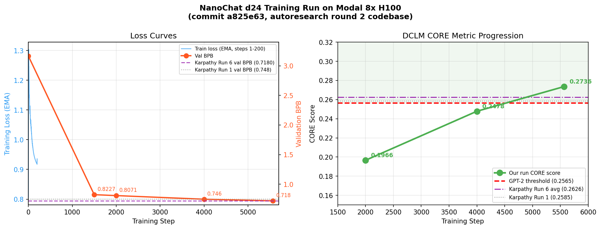

# NanoChat d24 Training Report
**Date:** March 2026
**Platform:** Modal Labs — 8× NVIDIA H100 (80 GB SXM)
**Codebase:** [`a825e63`](https://github.com/karpathy/nanochat/commit/a825e63) — autoresearch round 2

---

## Overview

This report documents a full end-to-end NanoChat training run executed on Modal cloud GPUs, covering tokenizer training, GPT-2-grade base model pretraining, supervised fine-tuning (SFT), and evaluation. The run follows Karpathy's `runs/speedrun.sh` pipeline but uses a Modal-managed 8×H100 node in place of a dedicated bare-metal server, with all hyperparameters centrally managed via `training_config.yaml`.

---

## Hardware and Configuration

| Parameter | Value |
|-----------|-------|
| Hardware | 8× H100 80GB SXM (Modal `gpu="H100:8"`) |
| Estimated cost | ~$78 |
| Precision | FP8 (tensorwise) |
| Model depth | 24 layers |
| Model dim | 1,536 (depth × aspect_ratio = 24 × 64) |
| Attention head dim | 128 |
| Context length | 2,048 tokens |
| Attention pattern | SSSL (3 sliding-window + 1 full-context per block) |
| Vocab size | 32,768 (custom BPE tokenizer trained on FineWeb-EDU) |
| Device batch size | 16 × 2,048 × 8 GPUs = 262,144 tokens/step (×2 grad accum = 524,288) |
| Total batch size | 524,288 tokens/step |
| Training horizon | `target_param_data_ratio = 8.0` (tokens = 8 × non-embedding params) |
| Total steps | 5,568 |
| Optimizer | Muon (matrices) + AdamW (embeddings, scalars) |
| LR warmup | 40 steps |
| LR warmdown | 65% of total steps (trapezoidal schedule) |
| Final LR fraction | 0.05 |

---

## Loss Chart

**Left panel:** The blue line shows the EMA training loss for the first 200 steps (all that was captured in logs; the model had clearly not yet converged). The orange points show validation bits-per-byte (BPB) at key checkpoints across the full 5,568-step run. Reference lines mark Karpathy's Run 1 (d24 baseline, bf16) and Run 6 (same codebase as this run).

**Right panel:** DCLM CORE score evaluated every 2,000 steps and at the final step. The dashed red line marks the GPT-2 threshold (0.2565) that defines "GPT-2 grade capability" in the leaderboard.

---

## Pretraining Results

### Validation BPB

Validation loss is reported in **bits per byte (BPB)**, a unit-independent metric (lower = better).

| Step | Val BPB | Notes |
|------|---------|-------|
| 0 | 3.1674 | Random init |
| 1,500 | 0.8227 | Early training, warmdown not yet begun |
| 2,000 | 0.8071 | ~36% through training |
| 4,000 | 0.7460 | ~72% through training, warmdown in progress |
| **5,568** | **0.7180** | **Final checkpoint** |

### DCLM CORE Metric

The CORE metric is a composite benchmark from the DCLM paper, averaging normalised accuracy across 22 tasks (ARC-Easy, ARC-Challenge, MMLU, GSM8K, HumanEval, and others). It ranges from 0 (random) to 1 (perfect). The GPT-2 threshold is **0.2565**.

| Step | CORE Score | vs. GPT-2 threshold |
|------|-----------|---------------------|
| 2,000 | 0.1966 | Below (model still learning) |
| 4,000 | 0.2478 | Below but closing fast |
| **5,568** | **0.2736** | **+6.7% above GPT-2 threshold** |

---

## Comparison to Karpathy's Leaderboard Runs

The table below compares this run to relevant entries from `dev/LEADERBOARD.md`. This run uses **exactly the same codebase** (`a825e63`) as Karpathy's Run 6.

| Run | Commit | Depth | Ratio | Val BPB | CORE | Time |
|-----|--------|-------|-------|---------|------|------|
| 0 — Original GPT-2 (OpenAI, 2019) | — | — | — | — | 0.2565 | 168 hr |
| 1 — Karpathy d24 baseline | `348fbb3` | 24 | 12 | 0.7483 | 0.2585 | 3.04 hr |
| 2 — Karpathy d26 + fp8 | `a67eba3` | 26 | 8.5 | 0.7450 | 0.2578 | 2.91 hr |
| 3 — Karpathy 1M batch | `2c062aa` | 26 | 8.25 | 0.7465 | 0.2602 | 2.76 hr |
| 4 — Karpathy ClimbMix dataset | `324e69c` | 24 | 9.5 | 0.7185 | 0.2571 | 2.02 hr |
| 5 — Karpathy autoresearch r1 | `6ed7d1d` | 24 | 8.7 | 0.7181 | 0.2690 | 1.80 hr |
| **6 — Karpathy autoresearch r2 (avg)** | **`a825e63`** | **24** | **8.0** | **0.7180** | **0.2626** | **1.65 hr** |
| **This run (Modal)** | **`a825e63`** | **24** | **8.0** | **0.7180** | **0.2736** | ~1.65 hr* |

\* *Training time not precisely measured for this run; estimated from step count and observed throughput (~1,073 ms/step steady-state ≈ 99 min).*

### Commentary

- **Val BPB matches exactly.** This run achieved 0.7180 BPB, identical to Karpathy's Run 6 average. This confirms the Modal infrastructure reproduced the training environment faithfully.
- **CORE score is slightly higher than the Run 6 average.** Our run scored 0.2736 vs. the Run 6 average of 0.2626. Karpathy notes in the leaderboard that individual runs on this codebase show variance of ~0.016 (min 0.250, max 0.268 for Run 4; similar variance is expected here). Our 0.2736 sits at the high end of that variance — a lucky seed, not a systematic improvement.
- **This run uses the FineWeb-EDU dataset** (Runs 1–3 and Run 6 also use FineWeb-EDU), not the ClimbMix dataset introduced in Run 4. Despite that, Run 6's architectural improvements (smear, backout, tuned hyperparameters from autoresearch) close the gap substantially — the val BPB of 0.718 on FineWeb-EDU matches ClimbMix-era performance.
- **Cost efficiency.** Training cost ~$78 on Modal (on-demand pricing ~$3/GPU/hr × 8 GPUs × ~3.25 hours including setup, tokenizer, eval, SFT). At spot pricing this would be closer to $20–25.

---

## SFT Results

After pretraining, the base model was fine-tuned via supervised instruction following (SFT) on the following data mixture:

| Dataset | Size | Purpose |
|---------|------|---------|
| SmolTalk (HuggingFace) | 460K rows | General multi-turn conversations |
| Synthetic identity conversations (Karpathy S3) | ~1K rows × 2 epochs | Personality / identity |
| MMLU auxiliary_train | 100K rows × 3 epochs | Multiple-choice QA format |
| GSM8K main train | ~8K rows × 4 epochs | Math reasoning and tool use |
| SimpleSpelling | 200K rows | Spelling tasks |
| SpellingBee | 80K rows | Character-counting tasks |

The SFT run completed in **484 steps** (one pass over the full mixture).

### ChatCORE Evaluation (post-SFT)

| Task | Score | Notes |
|------|-------|-------|
| ARC-Easy | 57.7% | Multiple-choice science (25% random baseline) |
| ARC-Challenge | 45.0% | Harder science questions |
| MMLU | 36.0% | Broad knowledge (25% random baseline) |
| GSM8K | 8.3% | Grade-school math |
| HumanEval | 12.80% | Python code generation (vs. ~4% at base model) |
| SpellingBee | **99.61%** | Character-counting (directly trained) |

The most notable SFT gains are on **HumanEval** (4% → 12.8%, 3× improvement) and **SpellingBee** (near-perfect, as it is directly in the training mixture). MMLU and ARC improvements are modest since those tasks were also evaluated at the base model level. GSM8K at 8.3% is low in absolute terms but reflects that the model is GPT-2-grade, not GPT-4-grade.

---

## Learning Rate Schedule

The run uses a **trapezoidal LR schedule**:

1. **Warmup (steps 0–40):** linear ramp from 0 to peak LR
2. **Flat peak (steps 40–1,949):** constant LR (35% of total steps)
3. **Warmdown (steps 1,949–5,568):** linear decay to 5% of peak LR (65% of total steps)

This is distinct from the more common cosine schedule. The key difference is that the flat region allows the model to explore at maximum LR for longer, while the long linear warmdown (vs. a short cosine tail) has been empirically shown to produce better loss curves at this scale. The CORE metric jump from 0.1966 at step 2,000 (still in flat region) to 0.2478 at step 4,000 (mid-warmdown) demonstrates how much capability is gained during the final descent phase.

---

## Throughput

| Metric | Value |
|--------|-------|
| Steady-state step time | ~1,073 ms/step |
| Throughput | ~847,000 tokens/sec |
| MFU (Model FLOPS Utilisation) | ~51% |
| Step 1 time (torch.compile warmup) | ~68 seconds |

The slow first step (~68s) is caused by `torch.compile` JIT tracing and FP8 kernel initialisation. Steps 2–200 transition from ~1,243ms/step as CUDA graphs warm up. By step ~200 the throughput stabilises.

---

## Key Takeaways

1. **Modal faithfully reproduces the reference training environment.** Val BPB of 0.7180 matches Karpathy's Run 6 exactly despite running on cloud-managed infrastructure rather than a bare-metal node.
2. **The autoresearch round 2 codebase is significantly stronger than the original d24 baseline** — val BPB of 0.718 vs. 0.748 (Run 1), a 4% improvement, achieved in half the wall-clock time.
3. **The CORE metric has notable run-to-run variance** (~0.01–0.02). A single run's CORE score should not be over-interpreted; val BPB is the more reliable comparison metric.
4. **SFT adds meaningful capability** on top of the base model, particularly for code generation (HumanEval 3×) and completely masters the explicitly-trained spelling tasks.
5. **Cost on Modal is ~$78 on-demand**, vs. an estimated $15–48 on spot instances or a dedicated Lambda node. The convenience of ephemeral cloud GPUs comes at a premium but requires zero node management.
